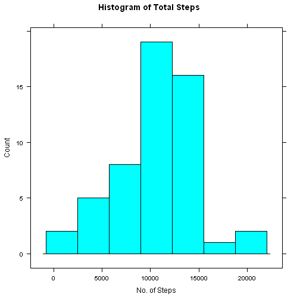
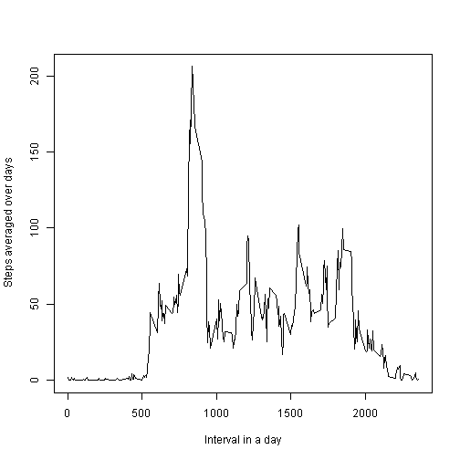
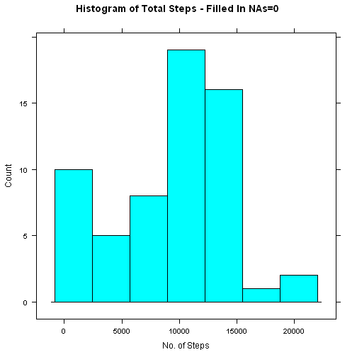
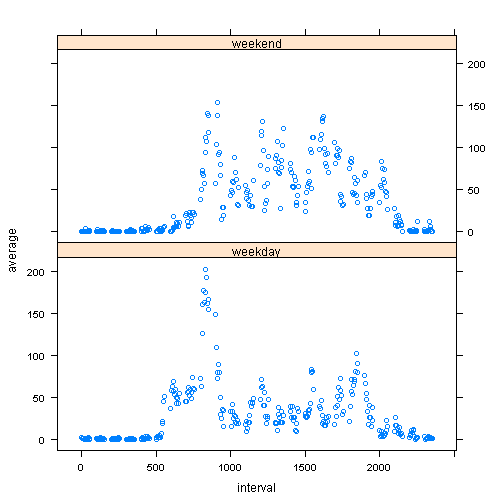

##Loading and preprocessing the data
0. Include the relevant libraries

```r
library("dplyr")
```

```
## 
## Attaching package: 'dplyr'
## 
## The following object is masked from 'package:stats':
## 
##     filter
## 
## The following objects are masked from 'package:base':
## 
##     intersect, setdiff, setequal, union
```

```r
library("lattice")
```

1. Show any code that is needed to Load the data (i.e. read.csv()) 

```r
df<-read.csv("activity.csv")
```
2. Process/transform the data (if necessary) into a format suitable for your analysis

##What is mean total number of steps taken per day?

1. Ignore the missing values in the dataset. Also convert the date column from character format to date format.

```r
df_in<-na.omit(df)
df_in$date<-as.Date(as.character(df_in$date), format="%Y-%m-%d")
```

2. The total number of steps taken per day were calculated using the dplyr library

```r
df_grp_by<-group_by(df_in, date)%>%summarise(total=sum(steps))
a<-df_grp_by[!is.na(df_grp_by$total),]
```

3. A histogram of the total number of steps taken each day

```r
histogram(~total,data=a,
       type="count",
       xlab="No. of Steps",
       main="Histogram of Total Steps")
```

 

4. The mean of the total number of steps taken per day

```r
mean_no_na=mean(a$total)
mean_no_na
```

```
## [1] 10766.19
```

5. and median of the total number of steps taken per day

```r
median_no_na=median(a$total)
median_no_na
```

```
## [1] 10765
```
##What is the average daily activity pattern?

1. A time series plot (i.e. type = "l") of the 5-minute interval (x-axis) and the average number of steps taken, averaged across all days (y-axis) was plotted


```r
df_t<-group_by(df_in, interval)%>%summarise(average=mean(steps))

plot(df_t$interval, df_t$average, ylab="Steps averaged over days", xlab="Interval in a day", type="l")
```

 

2. The 5-minute interval, on average across all the days in the dataset that contains the maximum number of steps:

The maximum average number of steps is:

```r
max(df_t$average)
```

```
## [1] 206.1698
```

The interval at which this maximum occurs is at:

```r
df_t$interval[df_t$average == max(df_t$average)]
```

```
## [1] 835
```

```r
df_t[df_t$average == max(df_t$average),]
```

```
## Source: local data frame [1 x 2]
## 
##   interval  average
## 1      835 206.1698
```

## Imputing missing values

Note that there are a number of days/intervals where there are missing values (coded as NA). The presence of missing days may introduce bias into some calculations or summaries of the data.

1. The total number of missing values in the dataset (i.e. the total number of rows with NAs) was determined as follows:

```r
 sum(is.na(df$steps))
```

```
## [1] 2304
```

2.The missing values in the dataset were simply filled in with zeros. A new dataset that is equal to the original dataset but with the missing data filled in.


```r
df$steps[is.na(df$steps)]<-0
```

3. A histogram of the total number of steps taken each day as well as the mean and median total number of steps taken per day.


```r
df$date<-as.Date(as.character(df$date), format="%Y-%m-%d")
df_grp_new<-group_by(df, date)%>%summarise(total=sum(steps))
```

The histogram with filled-in NAs:

```r
histogram(~total,data=df_grp_new,
       type="count",
       xlab="No. of Steps",
       main="Histogram of Total Steps - Filled In NAs=0")
```

 

The new mean:

```r
mean_with_na=mean(df_grp_new$total)
mean_with_na
```

```
## [1] 9354.23
```
compared to the old mean:

```r
mean_no_na
```

```
## [1] 10766.19
```
The new median:

```r
median_with_na=median(df_grp_new$total)
median_with_na
```

```
## [1] 10395
```
compared to the old median:

```r
median_no_na
```

```
## [1] 10765
```

The mean and median both decreased when the missing data was filled in with zeros. 

##Are there differences in activity patterns between weekdays and weekends?

1. For this part the weekdays() function was used as well as the dataset with the filled-in missing values.

2. A new factor variable is added to the dataset with two levels - "weekday" and "weekend" indicating whether a given date is a weekday or weekend day. The steps are as follows:
- Add a column to the dataset which stores the "day of the week" of character type using the weekdays() function.  The new column is called "day"


```r
df1<-mutate(df, day=weekdays(df$date))
```

- Then convert all items in the "day"  column named "Saturday" or "Sunday" to "weekend". Then convert all other days that are not "weekend" to "weekday".  Convert "day" to a factor variable.


```r
df1$day[df1$day=="Sunday"]<-"weekend"
df1$day[df1$day=="Saturday"]<-"weekend"
df1$day[!(df1$day=="weekend")]<-"weekday"
df1$day<-as.factor(df1$day)
```
3. A panel plot containing a time series plot (i.e. type = "l") of the 5-minute interval (x-axis) and the average number of steps taken, averaged across all weekday days or weekend days (y-axis) is created. 


```r
df2<-group_by(df1, interval, day)%>%summarise(average=mean(steps))
xyplot(average ~ interval | day, data = df2, layout = c(1, 2))
```

 

